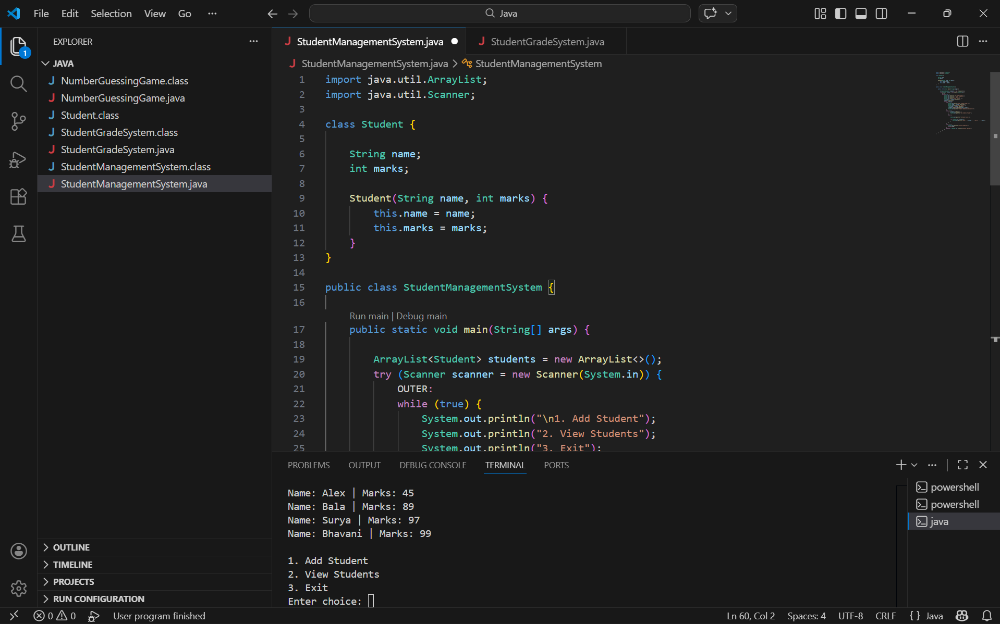

# Student Management System (Java)

A simple Java console application that allows users to manage student records.
The program allows adding and viewing students using basic Object-Oriented Programming concepts.

## Features

* Add student name and marks
* Store multiple student records
* View all students
* Menu-driven console interface

## Technologies Used

* Java
* ArrayList
* Object-Oriented Programming (OOP)
* Console-based input/output

## Project Structure

StudentManagementSystem.java
README.md

## How to Run

Compile the program:

javac StudentManagementSystem.java

Run the program:

java StudentManagementSystem

## Example Output

1. Add Student
2. View Students
3. Exit

Enter choice: 1

Enter student name: Surya
Enter marks: 85

Student added successfully!

## Concepts Demonstrated

* Classes and Objects
* ArrayList (Dynamic data storage)
* Loops
* Conditional statements
* Menu-driven programs

## Author

Surya
